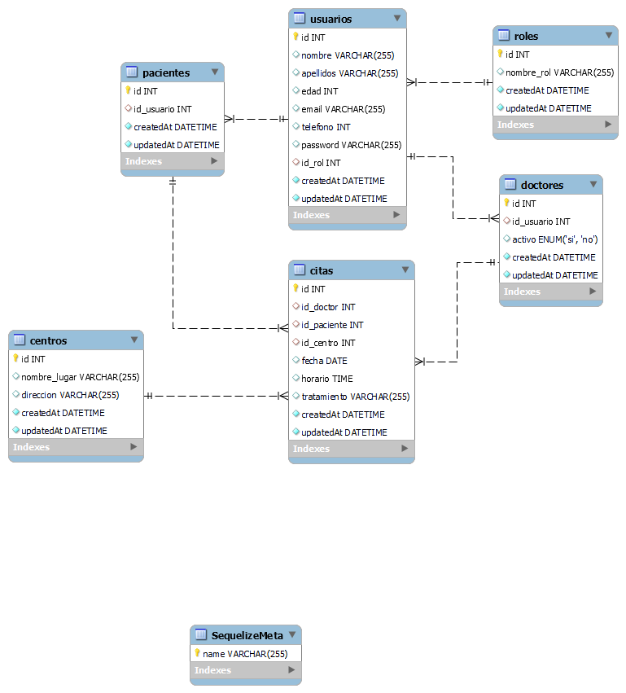

# Dental Clinic API

<details>
  <summary>Contenido 📝</summary>
  <ol>
    <li><a href="#objetivo">Objetivo</a></li>
    <li><a href="#sobre-el-proyecto">Sobre el proyecto</a></li>
    <!-- <li><a href="#deploy-🚀">Deploy</a></li> -->
    <li><a href="#stack">Stack</a></li>
    <li><a href="#diagrama-bd">Diagrama</a></li>
    <li><a href="#instalación-en-local">Instalación</a></li>
    <li><a href="#endpoints">Endpoints</a></li>
    <li><a href="#contribuciones">Contribuciones</a></li>
  </ol>
</details>

## Objetivo

Este proyecto requería una API funcional conectada a una base de datos usando sequelize y MySQL de una clínica dental

## Sobre el proyecto

Este proyecto de backend es un sistema de gestión de citas y tratamiento para pacientes. Esta aplicación web permite a la clínica gestionar de manera eficiente y automatizada todos los procesos necesarios para atender a sus pacientes de forma efectiva.

Para su desarrollo, se ha utilizado Sequelize junto con Node.JS, una herramienta de mapeo objeto-relacional que permite trabajar con bases de datos relacionales de forma más sencilla y eficiente, MySQL, un sistema de gestión de bases de datos ampliamente utilizado en el mundo empresarial debido a su estabilidad y escalabilidad, y Docker, una plataforma que permite a los desarrolladores empaquetar una aplicación con todas sus dependencias y librerías, en un contenedor independiente, lo que facilita su implementación en diferentes ambientes y sistemas.

La aplicación cuenta con distintos endpoints para la gestión de pacientes, gestion de doctores, citas y tratamientos, permitiendo a la clínica llevar un seguimiento de todos los procesos y procedimientos necesarios para brindar un servicio de calidad a sus pacientes.

<!-- ## Deploy 🚀
<div align="center">
    <a href="https://www.google.com"><strong>Url a producción </strong></a>🚀🚀🚀
</div> -->

## Stack

Tecnologías utilizadas:

<div align="center">
<a href="https://sequelize.org/">
    
</a>
<a href="https://www.expressjs.com/">
    
</a>
<a href="https://nodejs.org/es/">
    
</a>
<a href="https://developer.mozilla.org/es/docs/Web/JavaScript">
    
</a>
 </div>

## Diagrama BD



## Instalación en local

1. Clonar el repositorio
2. `$ npm install`
3. Conectamos nuestro repositorio con la base de datos
4. `$ Ejecutamos las migraciones`
5. `$ Ejecutamos los seeders`
6. `$ npm run dev`

## Endpoints

<details>
<summary>Endpoints</summary>

- AUTH

  - REGISTER

          POST http://localhost:3000/auth/register

    body:

    ```js
        {
            "nombre": "Lucas",
            "apellidos": "Hernandez",
            "email": "lucas@lucas.com",
            "password": "12345678"
        }
    ```

  - LOGIN

          POST http://localhost:3000/auth/login

    body:

    ```js
        {
            "email": "bolso@gmail.com",
            "password": "bolso"
        }
    ```

- USERS

  - OBTNER EL PERFIL DE UN USUARIO (USAR TOKEN)

          GET http://localhost:3000/users/profile

  - ACTUALIZAR USUARIO (USAR TOKEN)

          PUT http://localhost:3000/users/profile/update

    body:

    ```js
    {
        "nombre": "Luis",
        "apellidos": "Salerno",
        "edad": 35,
        "email": "luis@gmail.com",
        "telefono": 618560718,
        "password": "gallina"
    }
    ```

  - CHEQUEAR CITA PARA PACIENTES (USAR TOKEN)

          GET http://localhost:3000/users/appointments/checkall

  - CHEQUEAR CITA PARA DOCTORES (USAR TOKEN)

          GET http://localhost:3000/users/appointments/checkall/doctor

  - MOSTRAR TODOS LOS PACIENTES COMO ADMIN (USAR TOKEN)

          GET http://localhost:3000/users/profile/checkallpatients

  - MOSTRAR TODOS LOS DOCTORES COMO ADMIN (USAR TOKEN)

          GET http://localhost:3000/users/profile/checkalldoctors

- CHEQUEAR CITAS PACIENTE (USAR TOKEN)

          GET http://localhost:3000/users/appointments/checkall

  - CHEQUEAR CITAS DOCTOR (USAR TOKEN)

          GET http://localhost:3000/users/appointments/checkall/doctor

  - MOSTRAR TODOS LOS PACIENTES COMO ADMIN (USAR TOKEN)

          GET http://localhost:3000/users/profile/checkallpatients

  - MOSTRAR TODOS LOS DOCTORES COMO ADMIN (USAR TOKEN)

          GET http://localhost:3000/users/profile/checkalldoctors

- CITAS

  - CREAR CITA COMO PACIENTE (USAR TOKEN)

        POST http://localhost:3000/appointment/patient

  - BORRAR CITA COMO PACIENTE (USAR TOKEN Y PASAR ID DE CITA)

        DELETE http://localhost:3000/appointment/7

  - MODIFICAR CITA COMO PACIENTE (USAR TOKEN Y PASAR ID DE CITA)

        PUT http://localhost:3000/appointment/2

</details>

## Contribuciones

Las sugerencias y aportaciones son siempre bienvenidas.

Puedes hacerlo de dos maneras:

1. Abriendo una issue
2. Crea un fork del repositorio
   - Crea una nueva rama
     ```
     $ git checkout -b feature/nombreUsuario-mejora
     ```
   - Haz un commit con tus cambios
     ```
     $ git commit -m 'feat: mejora X cosa'
     ```
   - Haz push a la rama
     ```
     $ git push origin feature/nombreUsuario-mejora
     ```
   - Abre una solicitud de Pull Request
